## SQL Practice
- A relational database is a structured collection of data organized into tables, where each table represents a specific entity or concept, and each row in the table represents a unique instance of that entity. Relational databases use keys (such as primary keys and foreign keys) to establish relationships between tables, allowing for efficient and meaningful data retrieval.Examples of relational database systems include MySQL, PostgreSQL, Oracle Database, Microsoft SQL Server, and SQLite.

- Structured Query Language (SQL): SQL is a domain-specific language used for managing and manipulating data in relational databases.It provides a standardized way to interact with relational databases by allowing users to create, modify, and query data using a set of commands and statements.

- SQL bolt tutorial
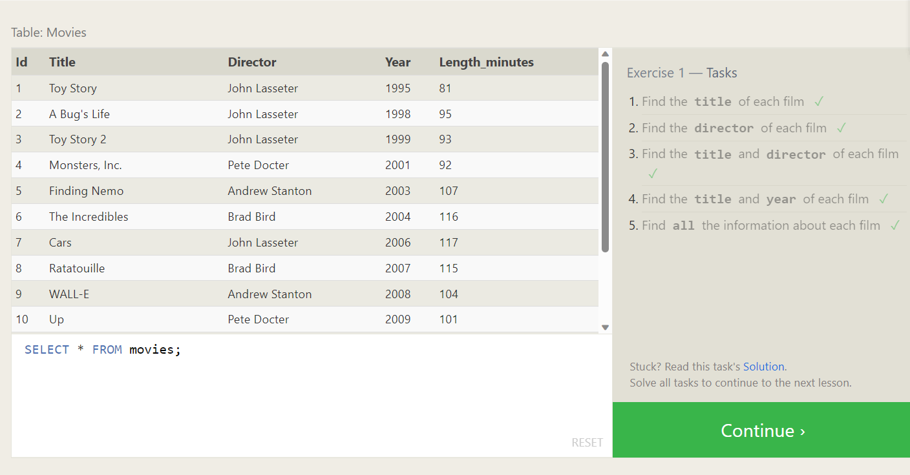
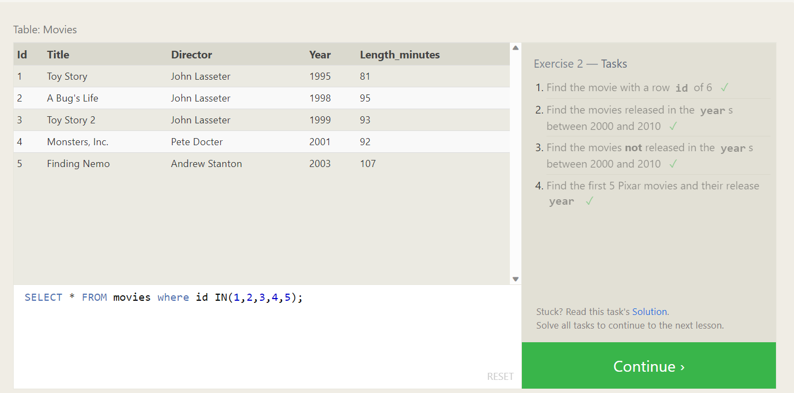
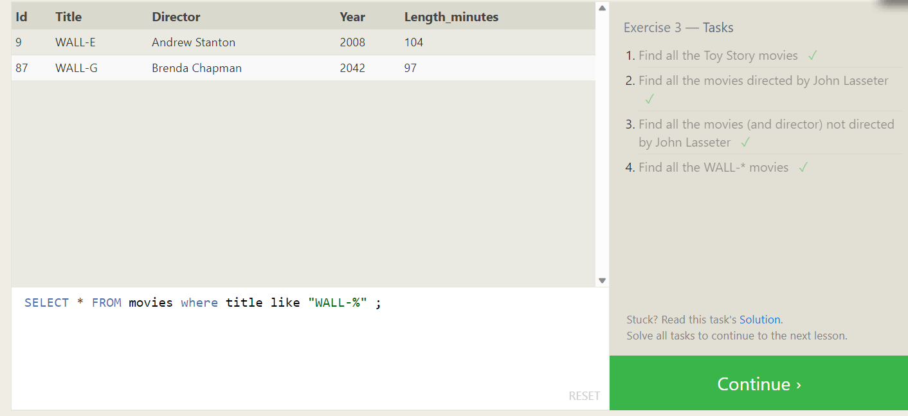
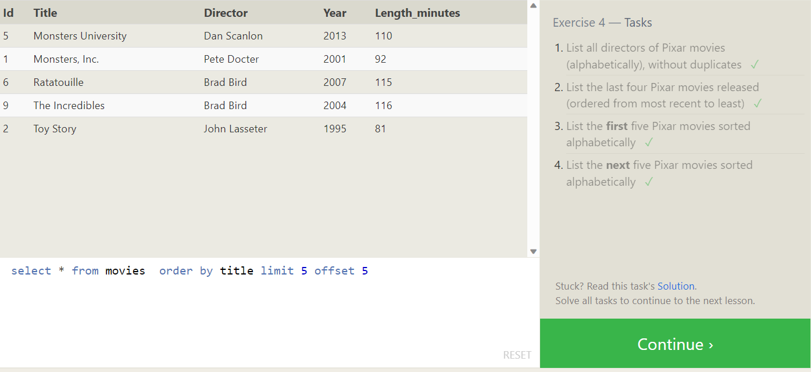
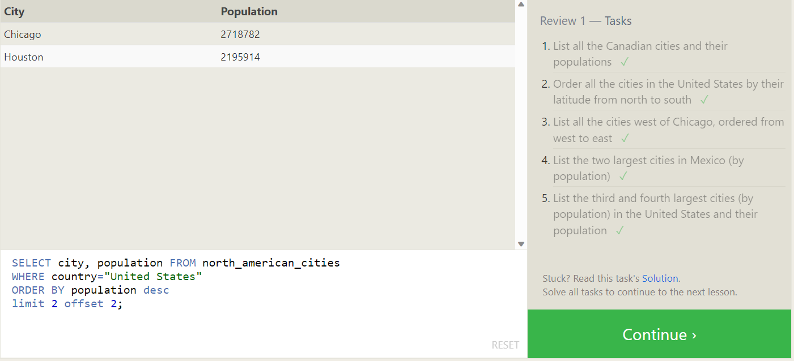
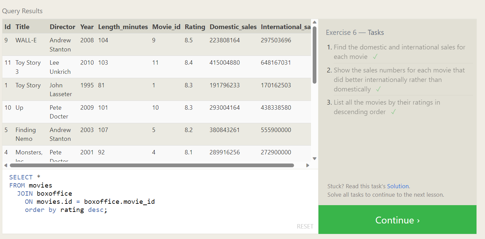

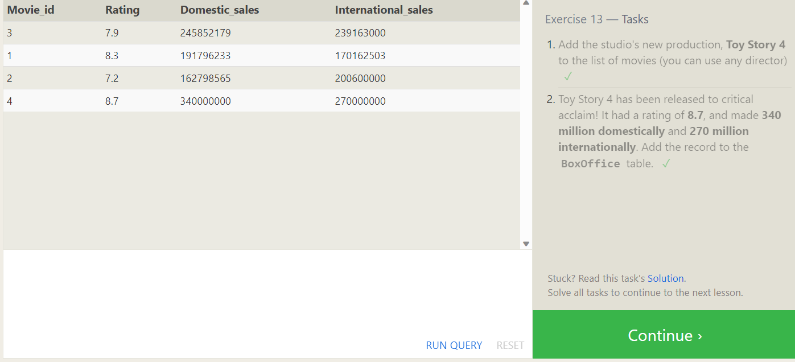
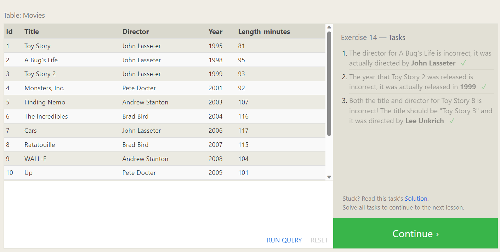
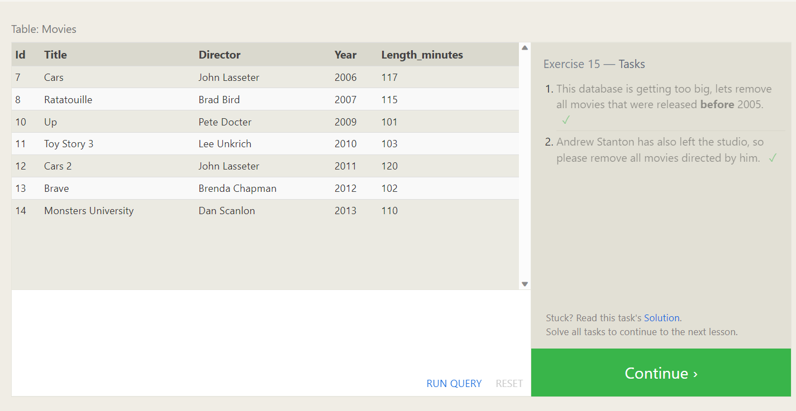
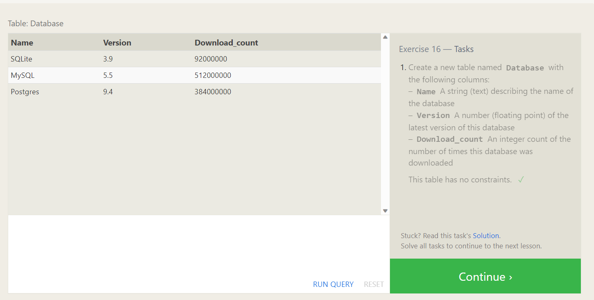
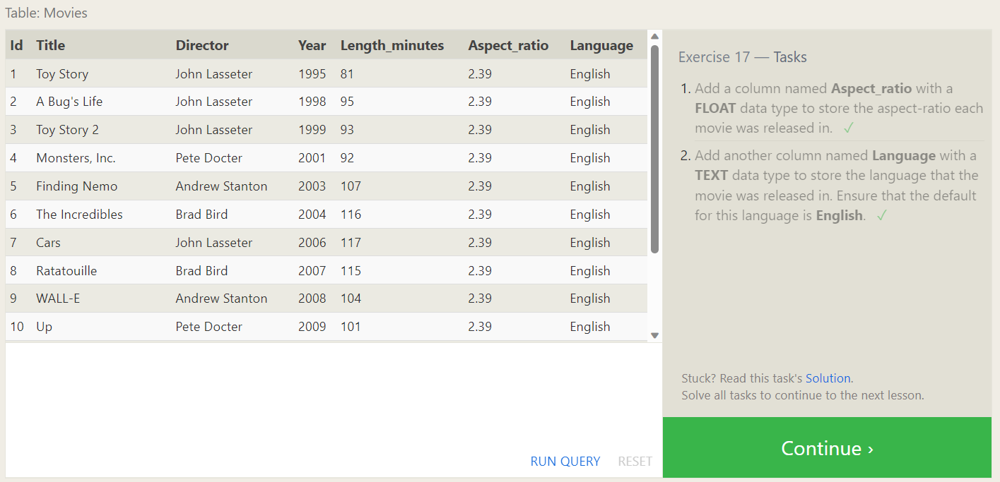
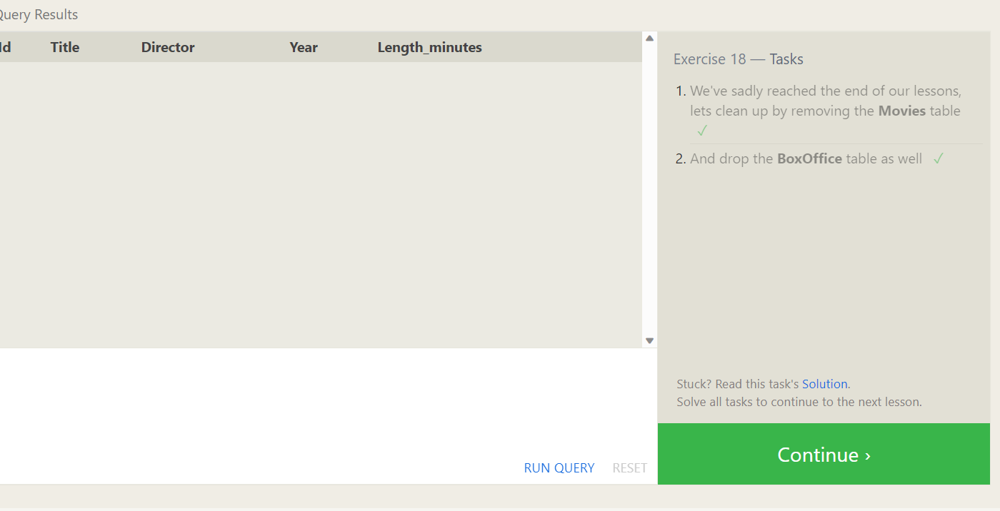
